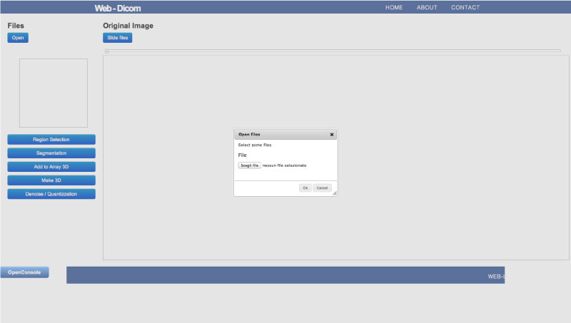
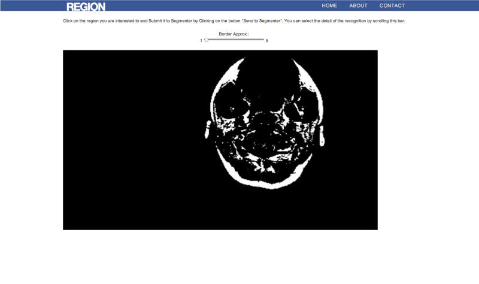
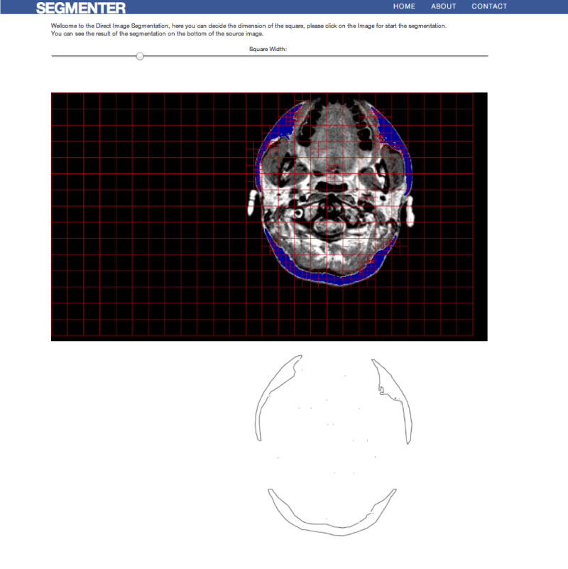

# **WebDicom- Project**
- - -

##HowTo:

###### The application need a server (es. Apache) to run. The easiest way to use the app is:
-  download and install xampp 
-  put code in xampp/htdocs/
-  run xampp controll and start apache
-  from browser (firefox) 127.0.0.1

### The application aims to
1. Upload and view stack of images dicom  
2. Manipulate images dicom
3. Extraction of areas of interest
4. Geometric simplification of the areas of interest
5. Build 3d models from a stack of images dicom

This guide help the user to use the web-application

- - -

### Upload and view stack of images dicom :

####- This is the index page of the project

####- From this page, using the botton open you can load one or more image dicom.

#### - The slide_files botton is usefull for show all image that you load

#### - The scroll bar gives you the possibility to choose between the images loaded

 

- - - 

### Manipulate images dicom :

#### - Moving the mouse on the canvas, initially white, you can choose the bone density of the image

- - - 

#### - An example is given by the two underlying images that represent the same image at different densities

- - -

### Extraction of areas of interest :

#### -Once you have chosen the density region the button "Region Selection" will open the page for the selection of the region of interest :

- - -
#### - Using the scrool bar you can choose the border approximation of the segmentation

#### - Clicking the area of ​​interest will be colored blue

#### - The selection extracted from the image is displayed in a new canvas

#### - At the end of this process with the "Send to Segmenter" botton you can load the segmenter page

- - -

### Geometric simplification of the areas of interest:

#### - The algorithm use a square that navigate the image to finf edge
#### - Using the scrool bar you can choose the square width of the algorithm 

- - -

#### - The segment from the image are displayed in a new canvas 

