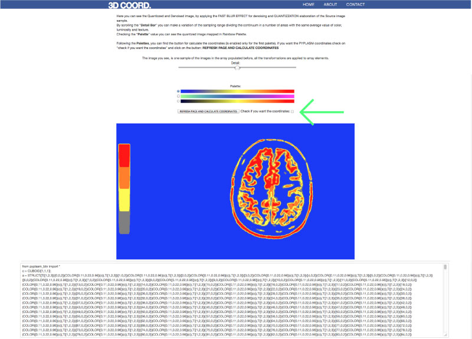
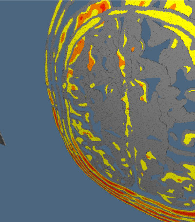

# **WebDicom- Project**

- - -

##HowTo_3d:

###### The application need a server (es. Apache) to run. The easiest way to use the app is:
-  download and install xampp 
-  put code in xampp/htdocs/
-  run xampp controll and start apache
-  from browser (firefox) 127.0.0.1

 - - -

### The application aims to

####Build 3d models from a stack of images dicom

- - -

####Load Stack of image

### Upload and view stack of images dicom :

####- This is the index page of the project

####- From this page, using the botton "Open" you can load one or more image dicom.

#### - The slide_files botton is usefull for show all image that you load

#### - The scroll bar gives you the possibility to choose between the images loaded

#### - For each image you choose you may push "Add to Array 3D" botton

 

- - - 

### Denoising/Quantizzation/Pseudocolor :

#### - After push image in the array you may run some filter on image by pushing "Denoise/Quantizzation" botton

#### - Loaded image has already been applied a blue filter

#### - You can choose the level of color quantizzation using the scrooll bar

#### - After that you may choose your "palette" for map grayscale in pseudocolor raynbow 

### Create_3D

#### -By checking the botton indicated from green indicator you can obtain the python coordinate for 3D computation  

### ScreenShoot

#### - Here are some sample from an array of 4 slice

- - -

